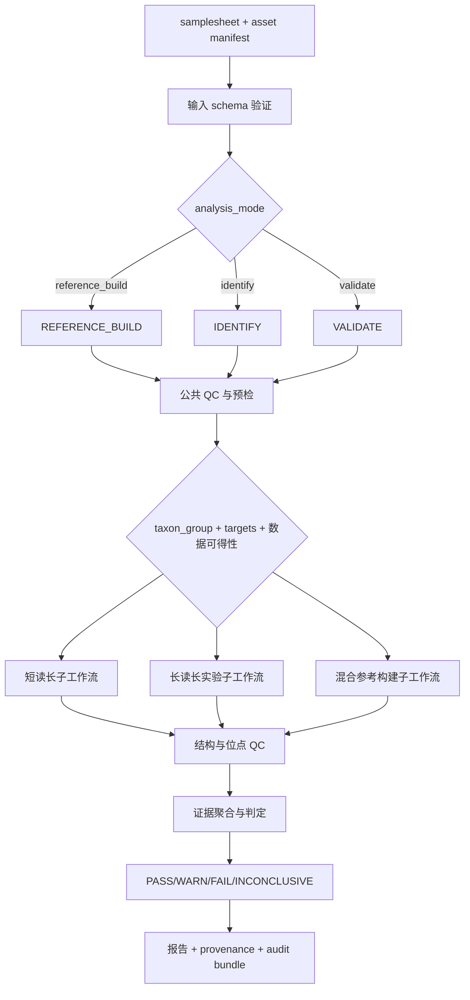

# 中药材细胞器基因组鉴定与 Nextflow 规范开发总方案

**文档版本**：v1.1.1（收口版）
**发布日期**：2026-08-07
**文档状态**：开发设计基线（Design Baseline），不是已经完成方法学确认的正式检测 SOP
**适用对象**：项目负责人、生物信息工程师、方法学验证人员、质量负责人、代码审阅者
**长期主体系**：OpenSpec + nf-core 模板 + Nextflow DSL2 + nf-test + GitHub Actions

---

## 0. 文档控制

### 0.1 文档目的

本文档将以下输入整合为一套能够进入 GitHub、持续开发、持续验证和长期维护的总规范：

1. 《中药材细胞器基因组鉴定方法学技术方案（生物信息学部分）》v1.0；
2. 《Nextflow 流程开发蓝图：中药材细胞器基因组鉴定系统》v1.0；
3. 《中药材细胞器基因组鉴定与 Nextflow 规范开发总方案》v1.1；
4. v1.1 复审意见及收口修订决议（Lean M0、HYP-DNA-001、独立比对证据定义、Polypolish 职责、hypothesis registry）。

整合建立从科学主张到软件发布证据的闭环：

```text
科学主张
  → 规范化需求
  → OpenSpec 变更
  → Nextflow 实现
  → nf-test 工程验证
  → 科学验证集验证
  → GitHub Actions 发布门禁
  → 版本化发布与审计归档
```

### 0.2 原始文件冻结记录

本次收口不修改、不覆盖任何前序文件。冻结信息如下：

| 原始文件 | SHA-256 | 处理方式 |
|---|---|---|
| `中药材细胞器基因组鉴定方法学技术方案_生信部分.md`（v1.0） | `a8d1ebda273681d568b62c7467f7c66d01df899efb870c91e55f8f152af3bdc3` | 科学方法学输入保留 |
| `Nextflow流程开发蓝图_中药材细胞器基因组鉴定.md`（v1.0） | `2af40a10729ba02b3e4d5a2ded4ece64c3e19f5a5fa1f1c4c87c60d4889584a7` | 工程蓝图输入保留 |
| `中药材细胞器基因组鉴定与Nextflow规范开发总方案_v1.1.md` | `d7120f380ea9b365d875433cf653af3709bf9a2458360e216cf898fcb2f33f10` | 治理基线保留，本版在其上收口 |

### 0.3 权威性与维护方式

"单一总文档"是面向评审和发布的完整规范快照，不意味着把所有可执行内容都手工维护在一个 Markdown 文件中。长期仓库采用以下规则：

1. 本总文档是每个正式版本的人类可读规范快照；
2. `openspec/specs/` 保存可执行、可审查的原子化需求；
3. schema、policy pack、tool registry、hypothesis registry、compatibility manifest 和测试断言分别保存为结构化文件；
4. 同一项要求通过稳定 Requirement ID 相互引用，不复制多份含义不同的长段落；
5. 正式发布时，总文档、OpenSpec 基线、代码、测试、参考资产兼容清单必须在同一 release tag 下保持一致；
6. 若总文档与可执行规范不一致，发布立即阻断，不能通过解释性备注绕过。

### 0.4 规范用语

| 用语 | 含义 |
|---|---|
| 必须 / MUST | 不满足即不能合并或发布 |
| 禁止 / MUST NOT | 明确不允许的行为 |
| 应 / SHOULD | 原则上必须满足，偏离时需形成书面设计决策 |
| 可 / MAY | 根据数据和项目阶段选择 |
| 实验性 / EXPERIMENTAL | 可研究、可测试，但不能作为正式鉴定结论的唯一依据 |

### 0.5 研究核验记录

本版基于项目会话内完成的官方资料核验，关键结论如下：

- OpenSpec 用 `proposal.md`、delta specs、`design.md`、`tasks.md` 和 archive 保存变更动机、设计、任务与历史（官方仓库 2026-08-07 仍活跃）；
- nf-core 模板能够生成标准目录、schema、文档、nf-test、GitHub Actions、`test`/`test_full` 和 RO-Crate 基础文件；
- nf-core 建议 pipeline、local modules 和 local subworkflows 使用 nf-test；
- Nextflow 版本不能长期写成"建议 24.x LTS"，应由 manifest 固定最低兼容版本并通过变更流程升级；
- PMAT2 官方 README（2026-08-07 核验）明确存在 `-x 0/1/2`（植物/动物/真菌）与 `-t hifi|ont|clr`，但 CycloneSEQ 适配仍需本项目验证。

主要官方资料：OpenSpec（github.com/Fission-AI/OpenSpec）、nf-core 文档（nf-co.re/docs）、Nextflow（github.com/nextflow-io/nextflow）、PMAT2（github.com/aiPGAB/PMAT2）。

### 0.6 v1.1 → v1.1.1 变更记录

| # | 变更 | 性质 | 位置 |
|---|---|---|---|
| 1 | 新增 Lean M0 profile：首批 5 个核心 spec 域、T0-only CI、CODEOWNERS 可兼任 | 新增实施规则 | 11.2、12.7、18-M0 |
| 2 | 新增 `HYP-DNA-001`（DNA 片段三档初始假设），区分"提取 DNA 片段分布"与"测序 read N50"两个指标 | 新增假设 + 术语修正 | 9.4、15.2 |
| 3 | 新增 hypothesis registry（`registries/hypotheses.yaml`）及状态机 | 新增治理对象 | 9.4、10.1 |
| 4 | `independent_alignment_support` 操作性定义取代"独立文库分子"措辞 | 定义修正 | 6.5 |
| 5 | Polypolish 适用性职责四层划分；插入长度降格为适用性特征之一 | 职责修正 | 6.4 |
| 6 | 首批 OpenSpec change 收敛为 2 个（bootstrap、core-contracts），其余随 milestone 创建 | 计划修正 | 11.4 |
| 7 | 其余全部继承 v1.1，未改动 | — | — |

---

## 1. 执行摘要与总体决策

### 1.1 总体结论

项目长期主体系确定为：

| 层级 | 选型 | 唯一职责 |
|---|---|---|
| 需求与变更治理 | OpenSpec | 定义为什么改、改什么、如何验收、何时归档 |
| 工程骨架 | nf-core pipeline template | 提供标准仓库、schema、文档、版本报告、模板同步和 CI 骨架 |
| 工作流执行 | Nextflow DSL2 | 实现模块化数据流、并行、恢复执行与多运行环境 |
| 工程测试 | nf-test | 验证 module、subworkflow 和 pipeline 的可执行行为 |
| 自动门禁 | GitHub Actions | 在 PR、定时任务和 release 上执行不同等级的检查 |
| 科学验证 | 独立验证数据集和预定义方案 | 验证鉴定正确性、错误风险、无法判定率和新增证据增益 |
| 任务执行辅助 | GSD（可选） | 协助阶段计划和执行，不充当第二套规范来源 |

### 1.2 产品边界

首个仓库不是单一工具的封装，也不是无限扩张的"万能细胞器平台"。它是一个具有三个明确 entry workflow 的中药材细胞器鉴定系统：

1. `REFERENCE_BUILD`：凭证材料和标准样本的参考库建设；
2. `IDENTIFY`：日常检品的参考引导鉴定和必要时的降级组装；
3. `VALIDATE`：工具转移、阈值标定、盲样验证和版本回归。

炮制品、复方、mini-barcode、metabarcoding、靶向捕获和 qPCR/dPCR 不在首版核心实现范围内；总规范保留接口，但必须通过后续独立 OpenSpec change 准入。

### 1.3 三项不可混淆的概念

系统必须同时区分：

1. **分析意图**：建设参考、鉴定未知样本或验证方法；
2. **生物学目标**：植物/动物以及 plastome、mitome、nrDNA 等目标；
3. **数据可得性**：仅短读长、仅长读长或混合数据。

数据组合只决定计算路线，不能自动决定样本是否具有参考级资格。拥有 DNBSEQ 和 CycloneSEQ 数据，不等于该样本可直接进入正式参考库。

---

## 2. 科学方法学总则

### 2.1 核心科学要求

| Requirement ID | 强制要求 |
|---|---|
| SCI-001 | 鉴定结论必须建立在预先定义的证据组合规则上，禁止只凭单一距离阈值或单个组装结果强制判定。 |
| SCI-002 | 细胞器基因组不得被描述为所有类群中的绝对物种身份证；杂交、叶绿体捕获、ILS、NUMT/NUPT/MTPT 等风险必须进入判定规则。 |
| SCI-003 | 纯 CycloneSEQ 序列默认只能作为结构证据、候选骨架或研究证据，不能单独升级为正式鉴定终序列。 |
| SCI-004 | 参考级终序列的可判定区域必须具备满足已验证 policy pack 的 DNBSEQ 位点证据。 |
| SCI-005 | 证据不足时必须保留不确定位点或输出 `INCONCLUSIVE`，禁止为了获得完整结果而强制补碱基、强制环化或强制归属。 |
| SCI-006 | 植物线粒体首版限定为研究性证据层，不进入日常鉴定的默认判定规则。 |
| SCI-007 | 动物核标记不能统一硬编码为 ITS2；每个分类群必须在 reference pack 中声明适用的 nuclear marker panel。 |
| SCI-008 | 检测 reads 比例不能直接解释为混合药材的质量比例；定量需求必须转入经验证的 qPCR/dPCR 或其他定量方法。 |
| SCI-009 | DNA 阴性不能直接推断原料从未存在，尤其是炮制品、深加工品和复方制剂。 |
| SCI-010 | 所有正式诊断位点必须通过独立个体发现、独立验证集确认，并记录不适用类群和已知例外。 |

### 2.2 方法学适用层级

| 对象 | 默认技术定位 | 可形成的结论 |
|---|---|---|
| 凭证标本、完整 DNA、双平台数据 | 参考库建设 | 通过验收后可形成参考级序列 |
| 常规药材、饮片、DNBSEQ 数据 | 日常检品 | 正品、非正品或无法判定 |
| 只有 CycloneSEQ 数据 | 结构解析或候选骨架 | 研究性结果，不单独形成正式终判 |
| 炮制品、严重降解样本 | 靶向或降级策略 | 按适用性声明报告，不以失败组装强判 |
| 复方和复杂混合物 | 独立扩展流程 | 首版核心流程不承担质量比例定量 |

### 2.3 植物和动物目标

#### 植物类药材

- 默认目标：完整 plastome + nrDNA/ITS 区域；
- 复杂类群：增加经过验证的核基因证据；
- 植物 mitome：保留在 `EXPERIMENTAL` 研究分支；
- 叶绿体结构、IR 边界和重排必须由组装图和独立 reads 证据解释。

#### 动物类药材

- 默认目标：完整 mitogenome；
- 核证据：由分类群专用 marker panel 指定，不把 ITS2 作为所有动物药的统一默认值；
- 必须检查 NUMT、异常覆盖、提前终止、基因缺失和与近缘参考的结构一致性；
- 长读长首选参考引导提取后对子集组装，避免将全基因组复杂度直接带入细胞器候选结果。

---

## 3. 系统架构

### 3.1 总体数据流



### 3.2 entry workflow 定义

| Entry workflow | 输入意图 | 主要输出 | 禁止行为 |
|---|---|---|---|
| `REFERENCE_BUILD` | 参考序列候选建设 | assembly、GFA、结构证据、polish evidence、candidate record | 仅凭双平台数据自动授予参考级 |
| `IDENTIFY` | 未知检品鉴定 | evidence bundle、decision JSON、报告 | 无参考时无条件启动大规模 de novo 并强判 |
| `VALIDATE` | 方法、工具、阈值和版本验证 | benchmark、confusion matrix、error spectrum、Go/No-Go 记录 | 使用验证集结果反向调整阈值后仍报告为独立验证 |

### 3.3 路由原则

工作流路由必须同时读取以下信息：

```text
analysis_mode
taxon_group
targets
short-read availability
long-read availability
specimen_role
reference_pack compatibility
policy_pack status
```

不能从 `leaf`、`root`、`voucher` 等样本描述推断植物/动物；不能从"有双平台数据"推断"参考级"；不能从文件扩展名推断测序平台。

---

## 4. 输入数据合同

### 4.1 samplesheet 最小字段

```csv
sample_id,analysis_mode,taxon_group,targets,short_reads_1,short_reads_2,long_reads,specimen_role,dna_integrity,reference_pack_id,policy_pack_id,batch_id
```

| 字段 | 类型 | 允许值或规则 | 必填条件 |
|---|---|---|---|
| `sample_id` | string | 仓库和批次内唯一；安全文件名字符 | 始终必填 |
| `analysis_mode` | enum | `reference_build`,`identify`,`validate` | 始终必填 |
| `taxon_group` | enum | 首版 `plant`,`animal` | 始终必填 |
| `targets` | list | `plastome`,`mitome`,`nrdna` 的允许组合 | 始终必填 |
| `short_reads_1` | path/URI | FASTQ/FASTQ.GZ | 有短读长时必填 |
| `short_reads_2` | path/URI | 与 R1 成对 | paired-end 模式必填 |
| `long_reads` | path/URI | FASTQ/FASTQ.GZ；平台另由 metadata 声明 | 有长读长时必填 |
| `specimen_role` | enum | `voucher`,`reference_candidate`,`routine_test`,`blind_control`,`negative_control`,`mixture_control` | 始终必填 |
| `dna_integrity` | enum | `hmw_pass`,`fragmented`,`degraded`,`unknown`；**最终应由验证后的规则从 QC 指标派生（见 HYP-DNA-001），派生规则冻结前允许人工填写并标记 `unknown` 人工来源** | reference_build 必填 |
| `reference_pack_id` | string | 已安装并兼容的资产 ID | identify 必填 |
| `policy_pack_id` | string | 已批准或明确 experimental 的 policy ID | 始终必填 |
| `batch_id` | string | 提取/建库/测序批次可追踪 | 正式运行必填 |

盲样真值不得写入分析 samplesheet。`VALIDATE` 的揭盲评价使用独立、访问受控的 `truthset.csv`，只能在所有样本级结果冻结并生成校验和后，由评价步骤加载。

### 4.2 输入验证要求

| Requirement ID | 要求 |
|---|---|
| DATA-001 | 所有 samplesheet 字段必须通过 JSON Schema 验证后才能创建分析 channel。 |
| DATA-002 | 路径存在性、压缩完整性、FASTQ 配对关系和样本 ID 唯一性必须在计算密集型步骤前检查。 |
| DATA-003 | 分析 samplesheet 禁止包含预期分类真值；`truthset.csv` 只能由揭盲评价步骤加载，防止真值泄漏。 |
| DATA-004 | `reference_build` 必须提供 specimen role、DNA 完整性、voucher metadata 记录或明确的缺失原因。 |
| DATA-005 | 缺少 reference pack 或版本不兼容时必须快速失败，不能静默使用默认公共数据库。 |
| DATA-006 | 分析模式、分类群和目标不允许通过文件名或目录名隐式推断。 |
| DATA-007 | 阴性对照和混合对照必须作为正式样本实体处理，不得在报告聚合前删除。 |

### 4.3 资产输入合同

正式运行至少加载以下资产：

```text
reference_pack
policy_pack
tool_registry
hypothesis_registry
compatibility_manifest
container_lock
```

每项资产必须具有：唯一 ID、版本、创建时间、维护者、校验和、来源、许可、适用范围和废弃状态。

---

## 5. 工作流设计

### 5.1 公共层

公共层负责数据完整性、平台特异 QC、污染预检和版本证据采集。

#### 短读长 QC

- 使用 fastp 或经批准的等价模块；
- 原始和清洗后统计必须同时保留；
- 未经方法学标定的 Q 值、最短长度、duplication 或 adapter 阈值不得作为 production 默认值；
- 生产阈值从已批准的 policy pack 读取。

#### 长读长 QC

- NanoPlot 用于描述性统计；
- 长度和质量过滤参数必须来自 CycloneSEQ 实测标定；
- 禁止直接照搬某个 ONT 化学版本的经验阈值；
- 保留过滤前后 reads 数、碱基量、长度分布和质量分布；
- 长读长 QC 输出必须包含 **read N50**，该指标与样本的提取 DNA 片段分布是两个不同量（见 9.4 HYP-DNA-001），报告中禁止混用"片段 N50"这一笼统称谓。

#### 污染预检

- Kraken2 仅作为预检和异常提示；
- 正式运行必须使用版本化自建数据库；
- 公共通用库的分类结果不能单独作为中药真伪结论；
- 对无法解释的污染信号输出 reason code，不自动删除所有被分类 reads。

### 5.2 `REFERENCE_BUILD`

#### 植物短读长候选路线

```text
QC → organelle read enrichment/assembly
   → plastome graph inspection
   → nrDNA assembly
   → read-back mapping
   → structural and site QC
   → candidate reference record
```

- GetOrganelle 可作为首选候选工具；
- NOVOPlasty 可作为独立算法复核，但不能规定"两者必须输出完全相同 fasta"；
- 两路线不一致时必须进入结构审查，保存 FASTG/GFA、覆盖和 reads 证据；
- 禁止因期望叶绿体为圆形而强行选择闭环路径；
- 在线 GeSeq、PlastidHub 等可作为人工注释辅助，不进入自动化生产核心链。

#### 动物短读长候选路线

```text
QC → mitogenome candidate assembly/extraction
   → annotation and gene integrity checks
   → NUMT risk assessment
   → read-back mapping
   → candidate reference record
```

- MitoFinder/MitoZ 的具体角色由 tool registry 和验证证据决定；
- 结果必须检查基因完整性、终止密码子、异常深度、异常分支长度和与近缘参考的结构关系；
- 核 marker 由 taxon-specific reference pack 声明。

#### 混合数据参考构建

```text
long-read structural candidate
  → independent long-read junction evidence（定义见 6.5）
  → DNBSEQ polishing candidate routes
  → short-read evidence reconciliation
  → graph + sequence + evidence bundle
  → candidate/reference grade decision
```

长读长负责结构候选，短读长负责位点证据；两者角色不能在报告中倒置。

### 5.3 `IDENTIFY`

默认采用 reference-first：

```text
QC → reference pack mapping/search
   → callable-region assessment
   → diagnostic-site evidence
   → taxonomic/likelihood evidence
   → decision engine
```

仅在下列条件同时满足时启动 de novo fallback：

1. reference pack 中不存在足以支持判定的近缘参考；
2. 数据达到相应组装入口的已验证适用条件；
3. 用户选择的分析策略允许 de novo；
4. 输出明确标记为 candidate 或 inconclusive，不因完成组装自动形成阳性结论。

### 5.4 `VALIDATE`

`VALIDATE` 不只是把 production pipeline 再跑一遍，而是执行：

- CycloneSEQ 与已知基准的错误谱比较；
- PMAT2、参考提取+子集组装等候选路线对比；
- 下采样和 DNA 降解梯度；
- 纯二代、纯三代、混合路线的盲法比较；
- negative、mixture、近缘困难组合和跨批次重复性；
- policy pack 候选阈值的冻结、锁定与独立验证；
- hypothesis registry 中条目的验证执行与状态迁移（见 9.4）。

### 5.5 状态输出模型

所有关键 subworkflow 必须输出机器可读状态文件，不依赖自由文本或隐式修改 meta map。

建议统一结构：

```json
{
  "sample_id": "S001",
  "stage": "assembly_qc",
  "status": "INCONCLUSIVE",
  "assembly_grade": "CANDIDATE",
  "decision": "INCONCLUSIVE",
  "reason_codes": ["INSUFFICIENT_JUNCTION_SUPPORT"],
  "policy_pack_id": "tcm-plant-experimental-0.1.0",
  "evidence_files": ["assembly.gfa", "junction_support.tsv"]
}
```

允许状态：

| 字段 | 允许值 |
|---|---|
| `status` | `PASS`,`WARN`,`FAIL`,`INCONCLUSIVE` |
| `assembly_grade` | `REFERENCE`,`DRAFT`,`CANDIDATE`,`NOT_APPLICABLE` |
| `decision` | `AUTHENTIC`,`NON_AUTHENTIC`,`INCONCLUSIVE`,`NOT_APPLICABLE` |

reason code 必须来自版本化字典，报告生成器只负责解释，不自行重新判断。

---

## 6. 长读长和混合数据的特殊规范

### 6.1 CycloneSEQ 的方法学定位

CycloneSEQ 长读长在本项目中主要解决：

- 重复区域和结构连接；
- plastome IR 边界和重排；
- 完整 mitogenome 候选结构；
- 无近缘参考时的探索性结构骨架。

在完成项目内错误谱、同聚物和平台转移验证前，不对 CycloneSEQ 使用未经验证的 ONT 模型或质量阈值。

### 6.2 PMAT2 准入结论

PMAT2 当前官方版本明确支持：

```text
-t hifi | ont | clr
-x 0: plants
-x 1: animals
-x 2: fungi
```

因此，PMAT2 animal mode 是客观存在的功能；但本项目按以下等级管理：

| 使用场景 | 首版等级 | 理由 |
|---|---|---|
| 植物 organelle + CycloneSEQ | `EXPERIMENTAL` | ONT 支持存在，但 CycloneSEQ 未完成转移验证 |
| 动物 mitogenome + CycloneSEQ | `EXPERIMENTAL` | animal mode 存在，但不替代参考提取+子集组装主路线 |
| 植物 mitome | `RESEARCH_ONLY` | 结构复杂，首版不进入常规鉴定 |

PMAT2 的工程实现还必须验证：

1. 官方 source build、Canu/NextDenovo 路径传递；
2. PMAT2 对 Apptainer/Singularity 的调用方式；
3. 是否存在嵌套容器问题；
4. x86_64 Linux 上的可重复安装与执行；
5. 真实 CycloneSEQ 样本的失败模式和资源需求。

在完成上述验证前，禁止在正式模块中声明虚构的 Wave/ORAS 镜像，也禁止使用 `latest` 标签。

### 6.3 纯长读长一致性处理

- Racon 可作为候选一致性步骤，但必须独立验证轮数和收益；
- medaka 的 ONT 预训练模型不能直接视为 CycloneSEQ 模型；
- Nanopolish 等依赖特定原始信号格式的工具，在输入物理条件不满足时禁止使用；
- 纯长读长结果的同聚物和 A/T 富集风险必须进入 evidence bundle；
- 不因覆盖较高而假定所有系统误差都能被多数表决消除。

### 6.4 混合抛光

首轮保留两类候选路线进行对照：

1. Polypolish 候选路线；
2. 显式比对、变异调用和共识生成路线。

**Polypolish 适用性的职责划分（四层）**：

| 层 | 职责 |
|---|---|
| tool registry | 记录 Polypolish 的验证状态和声明的适用条件 |
| validation record | 保存不同插入片段长度、重复区行为和 multi-mapping 条件下的实测结果 |
| policy pack | 只选择已验证通过的抛光路线 |
| samplesheet / library metadata | 提供实际文库信息（插入长度、建库方式等） |

适用性判定必须综合以下特征，**禁止由 `insert_size < 200` 等单一条件自动跳过**：

```text
插入长度
  + paired-end 关系
  + multi-mapping 行为
  + 重复区结果
  + 验证证据
  → 是否允许使用 Polypolish
```

NextPolish2 保持 `DEFERRED`，只有在 CycloneSEQ 骨架和本项目 DNBSEQ 数据上完成独立验证后才能通过 OpenSpec change 进入候选层。

### 6.5 结构连接证据

结构验收至少记录：

- junction 定义和坐标；
- 支持 reads ID；
- 比对长度、方向、identity 和两侧锚定长度；
- 可能的 chimeric read 或重复映射风险。

**独立支持的操作性定义**：长读长结构证据的独立性按 `independent_alignment_support` 判定，候选条件包括——

1. 不同 read ID；
2. 跨越同一 junction；
3. 两侧均达到已验证的锚定长度；
4. 比对方向和结构关系一致；
5. 起止坐标不完全相同；
6. 排除明显嵌合、secondary-only 和重复映射证据。

满足上述条件的证据在报告中表述为"**多条非重复长 reads 支持**"；**禁止**表述为已证明"来自独立文库分子"——分子独立性只有在元数据能够证明时才可声明。

---

## 7. 判定引擎

### 7.1 证据类别

| 证据 | 内容 | 主要风险 |
|---|---|---|
| E1 诊断位点 | 经验证的固定差异位点及其 reads 证据 | 个体内变异、参考偏倚、低覆盖 |
| E2 callable coverage | 可判定区域、缺失区域和方向性覆盖 | 覆盖不均、重复区域 |
| E3 分类定位 | 系统发育、似然或预构建参考框架中的位置 | 参考采样不足、模型不适配 |
| E4 结构证据 | IR、环化候选、重排、junction reads | 重复映射、嵌合 reads |
| E5 核证据 | nrDNA 或 taxon-specific nuclear marker | 杂合、拷贝差异、ILS |
| E6 对照证据 | 阴性、阳性、混合和批次对照 | 污染、index hopping、批次效应 |

### 7.2 判定规则

判定引擎必须读取 reference pack 中的规则，而不是把"正品四要素全部一致"等自然语言硬编码进流程。

每个分类单元应声明：

```text
required_evidence
supporting_evidence
conflict_rules
callable_regions
diagnostic_sites
uncertainty_rules
known_exceptions
nuclear_evidence_requirement
```

### 7.3 结果定义

| 结果 | 必要含义 |
|---|---|
| `AUTHENTIC` | 满足该 reference pack 的预定义正品证据规则，且不存在触发否决的冲突 |
| `NON_AUTHENTIC` | 满足预定义非正品证据规则，并可报告支持的分类单元或候选范围 |
| `INCONCLUSIVE` | 覆盖不足、证据冲突、参考缺失、复杂谱系或质量问题使规则无法完成 |

"无法判定"是合法的质量输出，不是 pipeline failure。pipeline failure 与 scientific inconclusive 必须分开编码。

### 7.4 系统发育定位

首版不得默认对每个样本重新执行完整 IQ-TREE 建树。优先方案为：

1. reference pack 提供版本化参考 alignment/tree；
2. 对检品执行轻量、可重复的定位或似然比较；
3. 疑难样本进入 expert review，可运行完整系统发育分析；
4. 新工具准入由 OpenSpec change 和验证数据决定。

---

## 8. 工具准入与版本注册

### 8.1 准入等级

| 等级 | 定义 | 是否可形成正式结论 |
|---|---|---|
| `APPROVED` | 已在指定数据、参数和环境中通过验证 | 可以 |
| `CONDITIONAL` | 原理适用，但只在声明条件下验证 | 满足条件时可以 |
| `EXPERIMENTAL` | 可运行或有上游支持，但未完成本项目验证 | 不可作为唯一依据 |
| `DEFERRED` | 暂不进入首版，保留后续评估 | 不可以 |
| `PROHIBITED` | 物理输入、模型或方法学假设不满足 | 不可以 |

### 8.2 tool registry

工具状态不再以"最近一次 GitHub 提交日期"写死在方法学正文中。仓库维护结构化 registry，例如：

```yaml
tool_id: pmat2
version: 2.1.5
role: long_read_organelle_candidate_assembly
admission_status: EXPERIMENTAL
supported_platforms:
  - ont
project_validated_platforms: []
container_digest: null
validation_record: null
review_date: 2026-08-07
```

`container_digest` 或 `validation_record` 为空时，production profile 必须拒绝使用该工具。

### 8.3 首版候选工具分层

| 工具 | 角色 | 初始等级 |
|---|---|---|
| fastp | DNBSEQ QC | `CONDITIONAL`，阈值待 policy 验证 |
| NanoPlot | 长读长描述性 QC | `APPROVED`，仅限描述性 QC |
| Kraken2 + 自建库 | 污染预检 | `CONDITIONAL`，不能独立真伪判定 |
| GetOrganelle | 植物 plastome/nrDNA 候选组装 | `CONDITIONAL` |
| NOVOPlasty | 植物候选复核 | `EXPERIMENTAL`，仅作独立候选复核 |
| MitoFinder/MitoZ | 动物 mitogenome 候选分析 | `CONDITIONAL`，具体角色待验证协议固定 |
| Flye | 长读长子集组装 | `EXPERIMENTAL` |
| PMAT2 | 长读长 organelle 候选组装 | `EXPERIMENTAL` |
| Racon | 纯长读长候选一致性 | `EXPERIMENTAL` |
| Polypolish | 混合路线候选抛光 | `EXPERIMENTAL`，适用性按 6.4 四层职责判定 |
| bcftools 共识路线 | 显式位点证据候选 | `EXPERIMENTAL` |
| NextPolish2 | 混合抛光 | `DEFERRED` |
| GeSeq/PlastidHub | 人工注释辅助 | `DEFERRED`，不进入自动化 production |

这里的初始等级是开发起点，不是最终 SOP 批准结论。

---

## 9. 阈值、policy pack 与 hypothesis registry

### 9.1 管理原则

| Requirement ID | 要求 |
|---|---|
| ENG-POL-001 | 未经验证的阈值不得出现在 production profile 的有效默认值中。 |
| ENG-POL-002 | 未标定值在通用 schema 中使用 `null`，production 启动时执行完整性检查。 |
| ENG-POL-003 | experimental policy 必须在输出中显著标识，不能伪装成 production。 |
| ENG-POL-004 | policy 变更必须单独版本化，并记录验证数据和适用 reference pack。 |
| ENG-POL-005 | 判定阈值、QC 阈值和资源参数必须分开；CPU/内存调整不能触发科学 policy 版本变化。 |

### 9.2 policy pack 示例结构

```yaml
policy_id: tcm-plant-experimental-0.1.0
status: experimental
scope:
  taxon_group: plant
  targets: [plastome, nrdna]
thresholds:
  short_read_qc: null
  callable_site: null
  junction_support: null
  uncertainty_zone: null
validation:
  protocol_id: cycloneseq-transfer-0.1
  record_id: null
```

该示例有意不提供临时数字。进入 production 前，所有被规则引用的字段必须非空，并由验证记录支持。

### 9.3 参数分类

| 参数类别 | 示例 | 版本策略 |
|---|---|---|
| 科学判定参数 | callable coverage、allele fraction、灰区规则 | policy pack 版本化 |
| 工具算法参数 | k-mer、overlap identity、assembler mode | tool registry + OpenSpec design |
| 运行资源参数 | CPU、memory、queue、time | institutional config，不改变科学版本 |
| 输入路径参数 | outdir、reference URI | 运行 manifest 记录 |

### 9.4 hypothesis registry（假设注册表）

#### 定位

项目中凡"有依据但未验证、且影响流程行为的科学假设"，统一登记于 `registries/hypotheses.yaml`，与 tool registry 平行管理。每条假设包含：ID、陈述、依据、适用范围、验证协议引用、状态和审阅日期。

#### 状态机

```text
proposed → under_validation → validated
                           ↘ rejected
validated / rejected → superseded
```

| 状态 | 含义 |
|---|---|
| `proposed` | 有理论或文献依据，尚未安排验证 |
| `under_validation` | 验证协议已冻结，实验进行中 |
| `validated` | 按协议验证通过，可转化为 policy 参数或流程行为 |
| `rejected` | 验证未通过，流程不得依赖该假设 |
| `superseded` | 被更新版本的假设取代（保留历史） |

#### 初始条目

```yaml
- hypothesis_id: HYP-DNA-001
  statement: >
    以提取 DNA 片段分布划分长读长适用档：
    ≥25 kb 为长片段候选档（可跨越典型植物 plastome IR，约20–25 kb）；
    10–<25 kb 为中间档（可上三代，但 IR 边界需短读长辅助确认）；
    <10 kb 为短片段/降解档（仅走短读长路线）。
  basis: 典型植物叶绿体反向重复区（IR）长度约 20–25 kb 的结构约束
  scope_notes: >
    该假设基于常见植物 plastome IR 长度提出；
    不能作为所有植物、动物和线粒体目标的通用真理；
    必须分别验证 plant plastome、animal mitome 和 plant mitome；
    动物 mitome（约16 kb环状、无IR结构）的跨越需求与植物 plastome 不同。
  metric_definitions: >
    必须区分两个指标——(a) 提取 DNA 的片段分布/主带/大于某长度比例
    （Qsep/FemtoPulse 等测定）；(b) 实际测序 reads 的 read N50
    （NanoPlot 测定）。两者禁止统称为"片段 N50"。
  derived_fields: [dna_integrity]
  status: proposed
  validation_protocol: null
  review_date: 2026-08-07
```

#### 派生规则

- `dna_integrity` 最终必须由验证后的规则从 QC 指标派生，不允许长期人工随意填写；
- 派生规则冻结前，samplesheet 中人工填写的 `dna_integrity` 必须在状态 JSON 中标记来源为 `manual`；
- 假设状态迁移（含 rejected）必须形成 OpenSpec change 记录。

---

## 10. 参考库与数据资产治理

### 10.1 资产拆分

| 资产 | 推荐管理方式 | 是否进入代码仓库 |
|---|---|---|
| 微型测试数据 | 独立 test-data branch/repository 或稳定对象存储 | 不直接放大文件 |
| 完整科学验证集 | 受控存储、DOI/对象存储、校验和清单 | 否 |
| 正品-伪品 reference pack | 独立数据发布单元 | 否 |
| Kraken2 数据库 | 可重建产物 + build manifest | 否 |
| 小型 schema/诱饵/marker 定义 | 代码仓库 `assets/` | 可以 |
| 容器锁文件 | 代码仓库 | 可以 |
| tool/hypothesis registry | 代码仓库 `registries/` | 可以 |

大型近缘参考不通过 Git LFS 直接长期绑定到 pipeline 仓库。

### 10.2 reference pack 内容

每个 reference pack 至少包括：

```text
FASTA sequences
taxonomic metadata
voucher/provenance metadata
diagnostic-site definitions
callable-region definitions
reference alignment/tree or likelihood resources
nuclear marker panel
known exceptions
license and citation
checksums
validation status
```

### 10.3 独立版本与兼容矩阵

禁止要求 pipeline、reference pack、Kraken DB 和 threshold policy 使用相同版本号。它们独立演进，由 compatibility manifest 声明兼容组合：

```yaml
compatibility_id: compat-2026-08-001
pipeline: 1.0.0
method_spec: 1.1.1
reference_pack: tcm-reference-2026.08.1
kraken_db: tcm-screen-2026.08.1
policy_pack: tcm-plant-1.0.0
validation_dataset: tcm-validation-1.0.0
```

### 10.4 数据库构建

Kraken2 自建库应由独立 utility workflow 根据声明的源数据重建。其 build manifest 必须记录：

- 输入 reference IDs 和 checksums；
- taxonomy 版本；
- 构建软件版本；
- 参数；
- 构建环境；
- 最终数据库 checksums。

---

## 11. OpenSpec 治理

### 11.1 OpenSpec 的定位

OpenSpec 是项目唯一的正式变更入口。issue 可以提出问题，GSD 可以协助拆任务，但任何改变科学行为、输入合同、输出合同、工具准入、阈值、假设状态、参考资产兼容性或发布门禁的修改，都必须先形成 OpenSpec change。

### 11.2 初始 specs（Lean M0 profile）

**首批只建立 5 个核心规范域**：

```text
openspec/specs/
├── scope-routing-and-input/        # 范围、非目标、路由原则、输入合同
├── asset-tool-and-policy/          # 资产合同、tool registry、policy pack、hypothesis registry
├── evidence-decision-and-status/   # 证据类别、判定规则、状态输出模型
├── validation-and-go-no-go/        # 转移验证、下采样、盲样、Go/No-Go
└── provenance-and-release/         # 归档、审计包、版本与发布门禁
```

规则：

1. 其余规范域（如 long-read-analysis、hybrid-reference-build 等细分域）随 M1–M5 按需创建，**禁止建立空目录凑数量**；
2. 每个域的首版 spec 只覆盖该 milestone 实际实现的行为，不提前冻结依赖未获实测证据的设计。

### 11.3 变更生命周期

```text
发现需求/问题
  → 创建 change/proposal.md
  → 编写 delta specs
  → 必要时编写 design.md
  → tasks.md
  → 实现和测试
  → PR 审阅
  → CI + 科学门禁
  → archive
  → release 或进入下一版本
```

每个 change 必须回答：

1. 为什么需要改变；
2. 哪些 Requirement ID 被新增、修改或删除；
3. 对输入、输出、资产和兼容性有什么影响；
4. 怎样自动验证；
5. 怎样进行科学验证；
6. 是否构成 breaking change；
7. 失败时如何回滚。

### 11.4 首批 change（收敛为 2 个）

| 顺序 | Change ID | 目的 |
|---|---|---|
| 1 | `bootstrap-nfcore-repository` | 创建干净的 nf-core 模板仓库、Lean M0 CI、OpenSpec 初始化 |
| 2 | `define-core-contracts` | 固定 samplesheet、status、asset、registry、policy、compatibility 等核心 schema |

其余 change（如 `add-plant-short-read-vertical-slice`、`evaluate-cycloneseq-pmat2-transfer`、`add-evidence-decision-engine` 等）**在相应 milestone 启动时创建**，避免尚未获得实测证据就提前冻结设计。

### 11.5 Requirement traceability

每个正式 Requirement ID 必须至少关联：

```text
OpenSpec spec
implementation path
nf-test ID
scientific validation record（如适用）
release evidence
```

没有测试或书面豁免记录的规范性要求不能标记为完成。

---

## 12. nf-core / Nextflow 工程架构

### 12.1 仓库位置与初始化

正式代码仓库建议创建于独立路径（如 `/Users/apple/Project/organelle-auth`）。使用当前稳定的 `nf-core pipelines create` 生成全新模板，保留模板的初始 vanilla commit，便于后续 `nf-core pipelines sync`。禁止在上层混合 Git 工作区中直接初始化本项目。

### 12.2 推荐目录

```text
organelle-auth/
├── .github/
│   ├── workflows/
│   ├── ISSUE_TEMPLATE/
│   └── PULL_REQUEST_TEMPLATE.md
├── assets/
│   ├── schema_input.json
│   ├── schema_status.json
│   └── reason_codes.yaml
├── conf/
│   ├── base.config
│   ├── modules.config
│   ├── test.config
│   ├── test_full.config
│   └── institutional/
├── docs/
│   ├── specification.md
│   ├── usage.md
│   ├── output.md
│   ├── validation.md
│   └── decisions/
├── modules/
│   ├── nf-core/
│   └── local/
├── subworkflows/
│   ├── nf-core/
│   └── local/
├── workflows/
│   ├── reference_build.nf
│   ├── identify.nf
│   └── validate.nf
├── openspec/
│   ├── specs/
│   └── changes/
├── policies/
├── registries/
│   ├── tools.yaml
│   └── hypotheses.yaml
├── tests/
├── main.nf
├── nextflow.config
├── nextflow_schema.json
├── nf-test.config
└── CHANGELOG.md
```

### 12.3 模块边界

每个 local module 必须满足：

- 单一工具或单一不可再分的转换职责；
- 标准 `meta` 输入输出；
- 明确 tuple 和 path contract；
- `versions.yml` 或模板当前规定的软件版本输出；
- 固定 container version/digest；
- 可执行 stub；
- 至少一个正常测试和一个失败/边界测试；
- 文档说明生物学假设，而不仅是命令行参数。

### 12.4 subworkflow 边界

建议首版 subworkflow：

```text
QC_SHORT
QC_LONG
SCREEN_CONTAMINATION
PLANT_SR_ASSEMBLY
ANIMAL_SR_MITOGENOME
LONG_READ_CANDIDATE_ASSEMBLY
HYBRID_POLISH_AND_EVIDENCE
ASSEMBLY_QC
REFERENCE_FIRST_IDENTIFY
EVIDENCE_DECISION
REPORT_AND_ARCHIVE
```

植物和动物不能被串成同一个固定的连续 subworkflow；必须在上游由显式 `taxon_group` 和 `targets` 路由。

### 12.5 Nextflow 版本策略

- 采用 DSL2；
- 最低兼容版本由 `manifest.nextflowVersion` 固定；
- CI 覆盖最低支持版本和批准的当前稳定版本；
- 版本升级使用独立 OpenSpec change；
- 首版不依赖 preview typed process 等可能变化的特性；
- 禁止在方法学正文长期写死"24.x LTS"等容易过期的描述。

### 12.6 容器和运行平台

| 环境 | 用途 | 规则 |
|---|---|---|
| macOS Apple Silicon | 规范、代码、schema、静态检查和不依赖 amd64 工具的轻测试 | 不运行 nf-core/BioContainers amd64 生信生产镜像 |
| GitHub-hosted x86_64 Ubuntu | PR 快速测试 | 只运行小数据、低资源测试 |
| x86_64 Linux 服务器 | 完整测试和生产 | 首选 Apptainer |
| SLURM/HPC | 批量生产 | 机构配置与核心仓库分离 |

生产容器必须固定 tag 和 digest；Conda/mamba 仅作为开发或工具打包兜底，不作为正式可重复性证据的唯一来源。

### 12.7 Lean M0 实施配置

| 项 | Lean M0 规则 |
|---|---|
| OpenSpec 规范域 | 首批 5 个（11.2），其余随 milestone 创建 |
| 测试层级 | M0 只运行 T0；M1 起 T1–T3；M3–M5 建设 T4–T6（13.2） |
| GitHub Actions | 首批只保留 `spec-schema`、`lint` 和最小模板检查三个 workflow；其余门禁随 milestone 启用 |
| CODEOWNERS | 作为职责分区而非人数要求；1–3 人团队可兼任，但科学行为变化与代码实现至少一次交叉审阅 |
| registry | tools.yaml 与 hypotheses.yaml 先建空框架 + HYP-DNA-001 首条目 |

此裁剪只裁"实施密度"，不裁架构：最终审计能力（T0–T6、完整门禁）不因此削弱。

---

## 13. 测试体系

### 13.1 两类验证必须分开

1. **工程测试**：证明代码按照合同运行；
2. **科学验证**：证明方法在声明的适用范围内具有可接受表现。

nf-test 不能代替盲样正确率、错误谱、诊断位点验证或正交实验。

### 13.2 六级测试模型

| 层级 | 名称 | 内容 | 执行时机 |
|---|---|---|---|
| T0 | Static contract | OpenSpec validate、schema、format、nf-core lint、依赖声明 | 每个 PR（M0 起） |
| T1 | Module contract | module 正向、边界、失败、versions 输出 | 每个 PR（M1 起） |
| T2 | Subworkflow behavior | 分支、状态传播、INCONCLUSIVE 和失败路由 | 每个 PR（M1 起） |
| T3 | Pipeline smoke | 三种数据组合和三个 entry workflow 的微型闭环 | 每个 PR（M1 起） |
| T4 | Real-data regression | 小型真实参考样本、关键输出和结构证据回归 | 定时和候选 release（M3 起） |
| T5 | Scientific qualification | 盲样、错误率、无法判定率、困难组合、正交验证 | 正式 release（M5 起） |
| T6 | Operational reproducibility | x86_64+Apptainer、resume、资源、重复运行和归档完整性 | 正式 release（M5 起） |

### 13.3 nf-test 要求

| Requirement ID | 要求 |
|---|---|
| TEST-001 | 每个 local module 至少有正常输入和失败/边界输入。 |
| TEST-002 | 每个 local subworkflow 必须验证路由和显式状态输出。 |
| TEST-003 | pipeline test 必须覆盖 short-only、long-only 和 hybrid；long-only 应产生受限等级结果。 |
| TEST-004 | snapshot 只用于稳定输出；易变时间戳、绝对路径和运行 ID 必须归一化或排除。 |
| TEST-005 | 不仅断言文件存在，还要检查关键 JSON schema、状态、序列长度范围和证据字段。 |
| TEST-006 | 对预期失败场景断言 reason code，避免把任意非零退出都视为正确失败。 |
| TEST-007 | 从 nf-core/modules 引入的模块先复用其测试，再补充本项目输入合同测试。 |

### 13.4 测试数据分层

| 数据集 | 内容 | 目的 |
|---|---|---|
| `test_tiny` | 人工微型 reads 和极小参考 | PR 快速执行 |
| `test_branch` | 覆盖关键分支、失败和无法判定 | 路由测试 |
| `test_real_small` | 可公开的小型真实样本 | 现实回归 |
| `validation_full` | 完整转移与盲样数据 | 科学准入 |
| `negative_and_mixture` | 阴性、近缘混合、污染和降解 | 特异性和失败边界 |

测试集版本必须独立于 pipeline 版本，并在 compatibility manifest 中记录。

---

## 14. GitHub Actions 与质量门禁

### 14.1 工作流分层

| Workflow | 触发 | 主要任务 | 运行环境 | 启用时点 |
|---|---|---|---|---|
| `spec-and-schema.yml` | PR/push | OpenSpec validate、JSON/YAML schema、追踪矩阵 | GitHub-hosted | M0 |
| `lint.yml` | PR/push | nf-core lint、format、Markdown/link 基础检查 | GitHub-hosted | M0 |
| `nf-test-changed.yml` | PR | 变更影响的 module/subworkflow 测试 | GitHub-hosted | M1 |
| `pipeline-smoke.yml` | PR | T3 微型 pipeline 测试 | GitHub-hosted x86_64 | M1 |
| `scheduled-regression.yml` | 周期执行 | T4、容器可拉取性、reference manifest 检查 | x86_64 self-hosted | M3 |
| `release-qualification.yml` | release candidate | T4–T6、科学记录和兼容矩阵 | 受保护 self-hosted | M5 |
| `release.yml` | 已批准 tag | 打包、checksums、RO-Crate、release notes | 受保护环境 | M5 |

### 14.2 PR 门禁

合并前必须满足：

1. OpenSpec change 完整且通过验证；
2. Requirement traceability 无断链；
3. schema/lint 通过；
4. 受影响 nf-test 通过（自 M1 起适用）；
5. pipeline smoke 通过（自 M1 起适用）；
6. 至少一名代码所有者审阅；
7. 科学行为变化由方法学负责人审阅（小团队可兼任，但不得同一人自审自批）；
8. 没有未解释的 `latest`、未固定 action、未固定容器或 production 临时阈值。

### 14.3 Release 门禁

正式 release 必须额外满足：

- `test_full` 和科学资格验证完成；
- compatibility manifest 完整；
- reference/policy/tool/container checksums 可解析；
- 所有 production 工具具有批准记录；
- changelog 和 migration notes 完成；
- 生成软件版本报告、参数文件、execution trace 和 RO-Crate；
- OpenSpec active change 已归档或明确排除在 release 范围外；
- 已完成回滚说明。

### 14.4 供应链安全

- GitHub Actions 第三方 action 固定到审核过的 commit SHA；
- workflow 使用最小 `permissions`；
- secrets 不进入 fork PR；
- 容器固定 digest 并记录来源；
- 发布生成 checksums；
- 依赖更新由自动 PR 提出，但不能自动越过科学验证门禁。

---

## 15. 科学验证与 Go/No-Go

### 15.1 CycloneSEQ 转移验证

至少包括：

1. 具有可信参考的植物和动物样本；
2. 相同或可比 DNA 的 DNBSEQ、CycloneSEQ 和必要的正交证据；
3. Q 值与实测错误率关系；
4. substitution、insertion、deletion、homopolymer 分层错误谱；
5. PMAT2、参考提取+Flye 子集和其他候选路线对比；
6. 结构 junction 真实性和假阳性（按 6.5 的 `independent_alignment_support` 定义计数）；
7. 重复运行稳定性、资源和失败率。

通过标准必须在揭示完整测试结果前写入版本化 validation protocol。通用仓库不提供未经标定的数字默认值。

### 15.2 下采样与降解梯度

按平台和目标分别建立：

```text
输入数据量
  → callable coverage
  → assembly completeness
  → structural evidence
  → diagnostic-site recovery
  → final decision stability
```

最低有效数据量取决于目标细胞器丰度、类群、DNA 完整性和判定任务，不能使用统一固定 Gb。

`HYP-DNA-001`（9.4）在本节验证：对 plant plastome、animal mitome、plant mitome 三类目标分别检验片段分布档位与实际组装/判定表现的关系，验证后迁移状态并派生 `dna_integrity` 规则；验证不通过则标记 `rejected` 并修订。

### 15.3 困难组合和盲样

验证集必须包含：

- 正品与最接近伪品；
- 叶绿体捕获、杂交或 ILS 风险类群；
- NUMT/NUPT/MTPT 风险；
- 同属近缘种；
- 不同产地和批次的独立个体；
- 降解梯度；
- 阴性和污染对照；
- 预定义混合样本。

发现集与验证集必须独立。每个分类单元的参考个体数、盲样数量和通过阈值由正式 validation protocol 预先冻结。

### 15.4 Go/No-Go 指标

Go/No-Go 至少评价：

```text
正确判定率
假阳性率
假阴性率
INCONCLUSIVE 率
诊断位点可重复性
结构假阳性率
跨批次一致性
单样本失败率
计算资源和人工复核负担
三代相对纯二代的经验证增益
```

如果 CycloneSEQ 或混合路线没有产生预定义的独立增益，长读长分支降为研究层，不进入正式鉴定 SOP。

### 15.5 正交验证

新诊断位点、关键结构连接和争议结论按风险使用独立方法验证，例如 PCR/Sanger 或其他适用技术。正交验证的样本选择、成功标准和不一致处理必须写入 validation protocol。

---

## 16. 版本、发布与审计

### 16.1 版本对象

| 对象 | 版本方式 |
|---|---|
| Pipeline | Semantic Versioning |
| Method specification | 独立文档版本（当前 1.1.1） |
| Reference pack | 独立数据版本 |
| Policy pack | Semantic Versioning |
| Kraken DB | 数据库构建版本 |
| Validation dataset/protocol | 独立版本 |
| Hypothesis registry | 随仓库版本，状态迁移留痕 |
| Container lock | 随 pipeline release 固定 |

### 16.2 Pipeline SemVer

- MAJOR：输入/输出合同、判定含义或主要 workflow 不兼容；
- MINOR：向后兼容的新路线、新报告或新工具准入；
- PATCH：不改变科学行为的 bug fix、文档或运行兼容修复。

阈值、诊断位点和判定规则变化不能仅作为 pipeline PATCH 隐式发布，必须升级对应 policy/reference 版本并更新兼容矩阵。

### 16.3 每次运行的最小审计包

```text
input samplesheet
normalized samplesheet
params and configs
pipeline version and commit
Nextflow version
tool versions
container digests
reference/policy/compatibility IDs
checksums
trace/timeline/report/DAG
per-sample status JSON
evidence bundle
final report
```

### 16.4 参考级序列归档

参考候选升级必须保存：

- voucher 和样本来源元数据；
- 原始 reads accession 或受控存储 ID；
- assembly FASTA 和 GFA；
- polishing 前后序列；
- variant/evidence files；
- junction 支持（按 6.5 定义）；
- annotation；
- 工具和参数；
- 审阅记录；
- reference pack release 记录。

### 16.5 发布规范要求

| Requirement ID | 要求 |
|---|---|
| REL-001 | 只有通过受保护的 release qualification workflow，且所有强制门禁均通过，才能发布正式版本和 release assets。 |
| REL-002 | Release tag 必须能够唯一解析 pipeline commit、OpenSpec 基线、container lock 和 compatibility manifest。 |
| REL-003 | 科学行为发生变化时，release notes 必须列出受影响的 Requirement ID、policy/reference 版本和迁移影响。 |
| REL-004 | 发现发布后科学性缺陷时，必须保留原 release、发布撤回或警示说明，并通过新版本修正；禁止无痕覆盖。 |

---

## 17. GitHub 协作治理

### 17.1 分支策略

若采用 nf-core 标准模板，保留其 `master`、`dev` 和 `TEMPLATE` 结构及同步机制：

- 功能开发从 `dev` 创建短生命周期分支；
- 所有功能通过 PR 合并；
- `master` 只接受经过 release qualification 的版本；
- `TEMPLATE` 用于 nf-core 模板同步，不混入业务开发；
- 禁止直接向受保护分支推送。

### 17.2 审阅责任

建议 CODEOWNERS 至少划分：

```text
Nextflow/modules         → 生信工程负责人
methods/policies         → 方法学负责人
reference schemas        → 数据库负责人
GitHub Actions/security  → 工程维护负责人
reports/documentation    → 质量与文档负责人
```

CODEOWNERS 是职责分区而非人数要求；同一人可以兼任多个角色，但科学行为变化和代码实现至少应有一次交叉审阅。

### 17.3 Issue 和 PR

Issue 模板至少包括：bug；scientific discrepancy；tool admission request；hypothesis status change；reference/policy update；feature request。

PR 模板必须要求填写：

```text
OpenSpec change ID
affected Requirement IDs
scientific behavior changed?
tests added/updated
validation evidence
breaking change?
rollback path
```

---

## 18. 开发里程碑

### M0：规范和仓库基础（Lean M0 profile）

**目标**：建立不会产生多套真相的项目骨架。

交付：

- nf-core vanilla repository（独立路径）；
- OpenSpec 初始化（首批 5 个核心规范域，11.2）；
- input/status/asset schema；
- tool registry（空框架 + 首版候选分层）、hypothesis registry（空框架 + HYP-DNA-001）、policy 和 compatibility 空框架；
- T0 CI（仅 `spec-schema`、`lint`、最小模板检查）；
- CODEOWNERS、PR/issue 模板；
- 本总规范进入仓库。

完成定义：空 pipeline 能通过 lint、OpenSpec validate 和 schema tests。

### M1：植物 DNBSEQ 最小纵向闭环

**目标**：从 samplesheet 到 `AUTHENTIC/NON_AUTHENTIC/INCONCLUSIVE` 机器可读结果跑通一条最小路线。

交付：short-read QC；植物 plastome/nrDNA 候选；read-back evidence；reference-first identify；status/reason code；T1–T3 测试。

完成定义：正常、低覆盖、污染和参考缺失样本均产生预期状态，不强判。

### M2：动物 DNBSEQ 路线

交付：动物 mitogenome 分支；NUMT 风险检查；taxon-specific nuclear marker 接口；独立测试集和 reason codes。

### M3：CycloneSEQ 实验和 PMAT2 转移

交付：长读长 QC；reference extraction + subset assembly；PMAT2 experimental module；错误谱、下采样（含 HYP-DNA-001 验证）和资源报告；Go/No-Go 记录；T4 启用。

完成定义：形成是否准入的证据，不以"工具成功运行"替代方法学通过。

### M4：混合参考构建

交付：long-read structure candidate；两类 short-read polishing/evidence 路线；junction evidence（按 6.5 定义）；candidate/reference grade；完整 audit bundle。

### M5：统一判定与 v1.0 资格验证

交付：versioned decision engine；reference/policy compatibility；T4–T6；盲样验证；release qualification；v1.0 release candidate。

### M6：扩展层

仅在核心 v1.0 稳定后考虑：炮制品 mini-barcode；metabarcoding；靶向捕获；qPCR/dPCR 定量接口；新分类群和新核 marker panel。每项扩展均独立创建 OpenSpec change，不直接堆入主流程。

---

## 19. 初始需求追踪矩阵

| Requirement ID | 实现区域 | 工程测试 | 科学验证 | Release 证据 |
|---|---|---|---|---|
| SCI-003 | long-read workflow + decision engine | long-only pipeline test | CycloneSEQ error/decision study | qualification record |
| SCI-004 | hybrid evidence subworkflow | site evidence nf-test | orthogonal site validation | evidence bundle |
| SCI-005 | status model + reporting | low-coverage/conflict tests | blind-set inconclusive analysis | decision JSON |
| DATA-003 | input schema/preflight | truth-field leakage test | 盲态冻结检查 | schema report |
| DATA-005 | asset preflight | incompatible pack failure | 不适用 | compatibility manifest |
| ENG-POL-001 | policy loader | production-null rejection test | threshold protocol review | policy approval record |
| HYP-DNA-001 | hypothesis registry + QC_LONG | 派生规则单测 | 15.2 下采样与降解梯度 | hypothesis 状态记录 |
| TEST-003 | pipeline tests | short/long/hybrid matrix | 不适用 | CI logs |
| REL-001 | release workflow | release dry run | qualification complete | release assets |

完整矩阵在 M0 中转为结构化文件并由 CI 检查。

---

## 20. 前序版本的迁移决策

| 前序内容 | v1.1.1 处理 | 原因 |
|---|---|---|
| 按短、长、混合三种数据分支 | 保留，但降为路由维度之一 | 还必须显式区分分析意图和生物学目标 |
| 不按样本来源分层 | 修正为"不按样本来源直接决定计算路线，但 specimen role 决定方法学资格" | 凭证和检品不能获得相同参考级资格 |
| 纯三代不作终判 | 保留 | 属于当前关键科学底线 |
| 所有待验证阈值不写死 | 保留并工程化 | 通过 policy pack 和 production fail-fast 实现 |
| fastp 等临时数字阈值 | 从强制正文移出 | 未验证前只能是实验候选值 |
| PMAT2 无 animal mode | 不采纳 | 官方 README 已有 `-x 1`（已核验） |
| PMAT2 animal 进入主流程 | 不采纳 | 功能存在不等于 CycloneSEQ 项目验证通过 |
| `group=leaf/root/voucher` 映射 taxo | 删除 | 样本来源、标本角色和分类群混淆 |
| `meta.assembly_grade` 隐式修改 | 删除 | 改为显式 status/evidence 输出 |
| `latest` 软件和容器 | 禁止 | 不能复现和审计 |
| 阈值集中写入 nextflow.config | 修正 | 科学阈值进入独立 policy pack |
| reference/Kraken/threshold 同版本号 | 删除 | 独立版本 + compatibility manifest |
| 近缘参考通过 Git LFS 随代码分发 | 默认删除 | 大型科学数据应独立发布 |
| IQ-TREE 每样本常规重建 | 改为 expert/optional | 日常路线优先版本化参考框架定位 |
| 13 个 OpenSpec 规范域 | 首批收敛为 5 个（Lean M0） | 裁剪实施密度，不裁架构 |
| "片段 N50" 笼统表述 | 修正 | 区分提取 DNA 片段分布与测序 read N50（HYP-DNA-001） |
| "≥3 条独立长 reads" | 修正为 `independent_alignment_support` | 分子独立性不可从 read ID 证明（6.5） |
| `insert_size < 200` 自动跳过 Polypolish | 删除 | 适用性由四层职责综合判定（6.4） |
| 首批 8 个 OpenSpec change | 收敛为 2 个 | 避免未获实测证据前冻结设计 |

---

## 21. 风险登记

| 风险 | 后果 | 控制措施 |
|---|---|---|
| CycloneSEQ 与 ONT 假设直接等同 | 错误过滤、组装和抛光 | 转移验证、experimental 状态、禁止模型错配 |
| 参考库错误或采样不足 | 高置信错误归属 | voucher/provenance、独立个体、版本化例外和核证据 |
| 工程测试替代科学验证 | 软件全绿但方法错误 | T0–T6 分层、release qualification |
| 临时阈值成为事实默认 | 难以追溯的偏差 | policy pack、production null rejection |
| 未验证假设被当作参数使用 | 路由和资格判定失真 | hypothesis registry 状态机（9.4） |
| 过度依赖在线服务 | 不可复现、隐私和可用性风险 | 在线服务仅人工辅助，保存输入输出和日期 |
| 大型参考数据绑定 Git | 仓库膨胀、版本混乱 | 独立资产发布和 checksums |
| Apple Silicon 运行 amd64 生信容器 | 失败或不可比性能 | Mac 只做轻测试，生产用 x86_64 Linux |
| PMAT2 嵌套容器或依赖链失败 | 模块无法稳定部署 | M3 独立验证，必要时拆解或外部执行合同 |
| 复杂类群只用细胞器 | 叶绿体捕获/ILS 导致误判 | 强制 taxon-specific nuclear evidence |
| 自动更新依赖改变科学行为 | 隐性结果漂移 | 固定版本/digest，升级走 OpenSpec |

---

## 22. v1.0 发布完成定义

项目只有同时满足以下条件才能声明 v1.0：

1. 三个 entry workflow 的范围和输出合同稳定；
2. production 使用的每个工具均有批准记录和固定容器；
3. production policy 不包含未标定值；
4. 至少一套批准的 reference/policy/validation 兼容组合；
5. T0–T6 完成；
6. blind validation 达到预先冻结的 Go 标准；
7. `INCONCLUSIVE` 路径经真实样本验证；
8. x86_64 Linux + Apptainer 完成端到端复现；
9. 文档、schema、OpenSpec、代码、测试和报告一致；
10. release bundle 包含 checksums、RO-Crate、版本、参数和审计记录；
11. 已说明适用范围、限制和禁止外推的场景；
12. 至少一次独立代码审阅和方法学审阅完成。

---

## 23. 下一阶段实施入口

本总规范批准后，不直接一次性实现全部工具。下一步只进入 M0（Lean profile），两个首批 change 依次为：

```text
1. bootstrap-nfcore-repository
   - 独立路径创建仓库，nf-core 当前模板生成 vanilla baseline
   - OpenSpec 初始化（5 个核心规范域）
   - T0 GitHub Actions（spec-schema / lint / 最小模板检查）
   - CODEOWNERS、PR/issue 模板
2. define-core-contracts
   - schema_input.json（4.1 字段全集）
   - schema_status.json + reason_codes.yaml（5.5 模型）
   - registries/tools.yaml（8.3 分层）、registries/hypotheses.yaml（HYP-DNA-001）
   - policies/ 与 compatibility manifest 空框架
   - 本规范纳入 docs 并建立 Requirement traceability
```

M0 通过审阅后，才进入 M1 植物 DNBSEQ 最小纵向闭环。

---

## 24. 结论

长期维护的关键不是选择更多工具，而是把科学边界、输入合同、工具资格、假设状态、阈值、参考数据、测试证据和发布决策全部版本化并相互追踪。

本方案最终确定：

> OpenSpec 管变更，nf-core 管工程骨架，Nextflow 管执行，nf-test 管工程行为，科学验证集管方法学有效性，GitHub Actions 管发布纪律；所有正式结论都必须能从 Requirement ID 追溯到代码、测试、验证记录和 release 资产；所有未验证假设都必须在 hypothesis registry 中有明确状态。

这套结构允许项目从当前中药材鉴定场景起步，同时保留向更广泛细胞器应用扩展的能力，而不牺牲首版范围、审计性和长期维护性。
